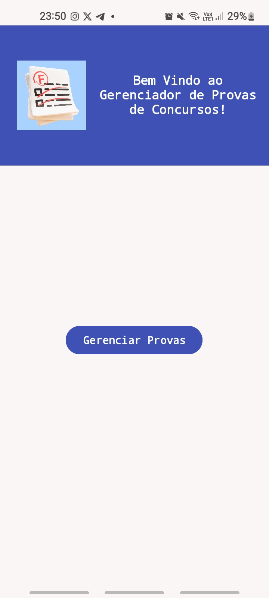
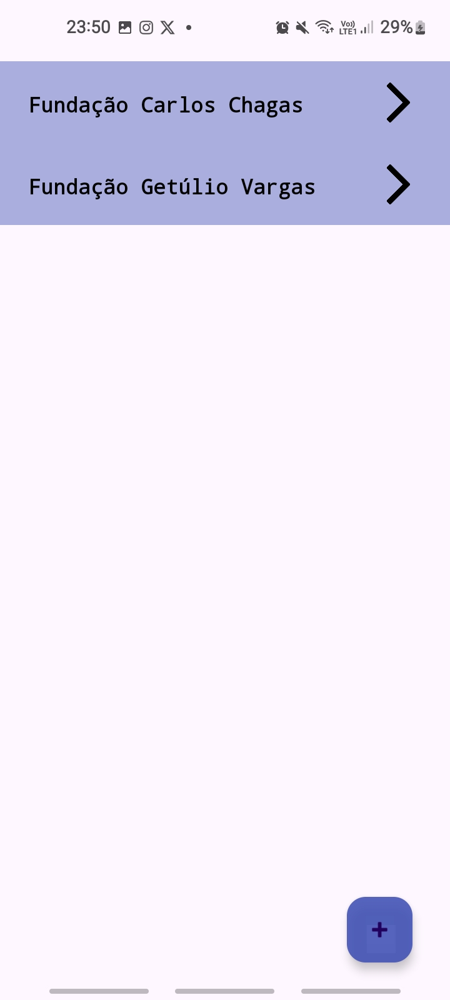
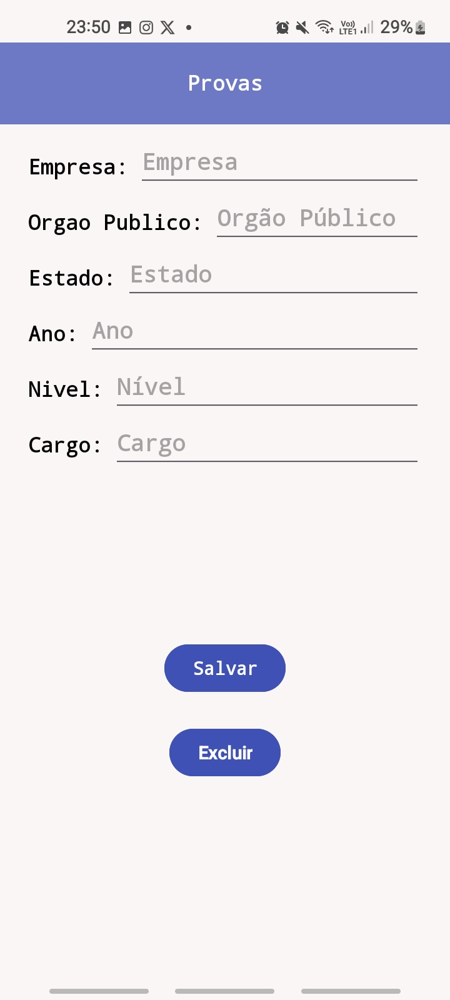

**Gerenciador de Provas**

Este repositório contém uma versão parcial do sistema de questões de concurso, desenvolvido como parte da disciplina de Tópicos Avançados de Programação (TAP). Essa parte do sistema foi criada para permitir aos usuários armazenar informações sobre diferentes provas de concursos, incluindo detalhes como a empresa responsável pela aplicação da prova, o órgão público que está promovendo a prova, o estado onde a prova ocorreu, o ano da prova, o nível de escolaridade para o qual a prova é destinada e o cargo concorrido. 

### Estrutura do Projeto

Muitas pastas e arquivos são criados automaticamente quando um projeto é criado no Android Studio, incluindo pastas como "build", "gradle", ".idea", entre outras, e isso poderia sobrecarregar o repositório de informações, portanto optei por incluir apenas a pasta "app", que contém os códigos Java e os arquivos XML das activities do aplicativo. O projeto está estruturado da seguinte maneira: :

*   **src/main/java:**
    
    *   **Provas:** Modelo de uma prova, contendo informações como empresa, órgão público, estado, ano, nível de escolaridade e cargo.
    *   **ProvasDAO:** Data Access Object (DAO) responsável pela manipulação dos dados das provas no banco de dados SQLite.
    *   **MainActivity:** Esta activity possui mensagem de boas-vindas. Há um botão "Gerenciar Provas" que direciona os usuários para a ListActivity.
       

    *   **ListActivity:** Esta activity será modificada para conter uma lista de provas utilizando o componente RecyclerView.
       

    *   **EditActivity:** Controla uma tela para criar uma nova prova ou visualizar e editar uma prova existente.
       

*   **src/main/res/layout:**
    
    *   Arquivos XML que representam as interfaces de usuário (layouts) das activities do aplicativo. Esses arquivos podem ser adaptados em um novo projeto no Android Studio. O modelo utilizado é "Empty Views Activity".

### Tecnologias Utilizadas

*   **Linguagem de Programação:** Java
*   **Ambiente de Desenvolvimento:** Android Studio
*   **Banco de Dados:** SQLite

### Requisitos do Sistema

*   **Minimum SDK:** API 21 (Lollipop; Android 5.0)

